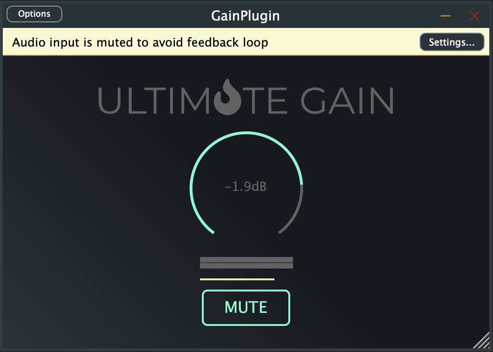

# GainPlugin

(Experimental) VST/AU audio plugin example based on [JUCE](https://github.com/juce-framework/JUCE) with [React-JUCE](https://github.com/JoshMarler/react-juce) for UI.

**NOTE**: *This example wasn't built from scratch. Basically, it's a fork of [GainPlugin](https://docs.react-juce.dev/guides/running_the_examples#gainplugin) example from React-JUCE framework. This fork just collects all the third-party submodules in one place and provides the instructions.*



## Minimum System Requirements

**PLEASE NOTE**: *At this moment, this example was only tested on [MacOSX 12.4](https://www.apple.com/macos/monterey/) and [XCode 13.4](https://developer.apple.com/xcode/). It should also work on Windows with almost no changes (except of setting up the `GAINPLUGIN_SOURCE_DIR` variable specifically for Windows OS in [GainPlugin.jucer](./GainPlugin.jucer) file). As soon as there is a Windows machine come up, the corresponding support should be added. Contributions are also welcome!*

### 1. JUCE

Check out its [Minimum System Requirements](https://github.com/juce-framework/JUCE#minimum-system-requirements).

### 2. React-JUCE

The only additional dependency will be [NodeJS](https://nodejs.org/en/). Check out React-JUCE [Dependencies](https://docs.react-juce.dev/guides/getting_started#dependencies) doc.

## Cloning Repository

Clone with `--recurse-submodules` flag:

```bash
git clone --recurse-submodules git@github.com:satelllte/GainPlugin.git
```

You might also need to update the react-juce's submodules:

```bash
cd react-juce
git submodule update --init --recursive
```

## Third-party Submodules

| Name | Version | About |
|---|---|---|
| JUCE | [6.1.6](https://github.com/juce-framework/JUCE/releases/tag/6.1.6) | To know more about what JUCE is check out its [docs](https://github.com/juce-framework/JUCE#readme). The reason it's used here as a submodule is because all of its modules linked via relative paths in [GainPlugin.jucer](GainPlugin.jucer) configuration file. |
| React-JUCE | [0.1.0](https://github.com/JoshMarler/react-juce/tree/0693801a8646f9327d300f931728d1f4f3c58ae8) | To know more about what React-JUCE is check out its [docs](https://github.com/JoshMarler/react-juce/tree/master#react-juce). The reason it's used here as a submodule is because the `react-juce` module linked via relative path in [GainPlugin.jucer](GainPlugin.jucer) configuration file. |

## Getting Started

### 1. Bundling UI files

```bash
cd Source/jsui
npm install
npm run build
```

### 2. Generating project via Projucer

[Projucer](https://github.com/juce-framework/JUCE/tree/6.1.6#the-projucer) is a project-configuration tool provided by JUCE. 

To get the executable file you can:

1. Build it from source for your platform. Check out [/JUCE/extras/Projucer/Builds/](/JUCE/extras/Projucer/Builds/) folder.
2. Download pre-built executables. Check out the archive files of [JUCE 6.1.6 release](https://github.com/juce-framework/JUCE/releases/tag/6.1.6).

Now, when Projucer executable is installed and available to run, [GainPlugin.jucer](GainPlugin.jucer) configuration file can be opened in it and the project for Xcode or Visual Studio (depending on operating system) can be generated.

For more info on Projucer, check out [Tutorial: Projucer Part 1: Getting started with the Projucer](https://docs.juce.com/master/tutorial_new_projucer_project.html).

### 3. Develop & Build JUCE project for release

Check out [Tutorial: Projucer Part 2: Manage your Projucer projects](https://docs.juce.com/master/tutorial_manage_projucer_project.html).